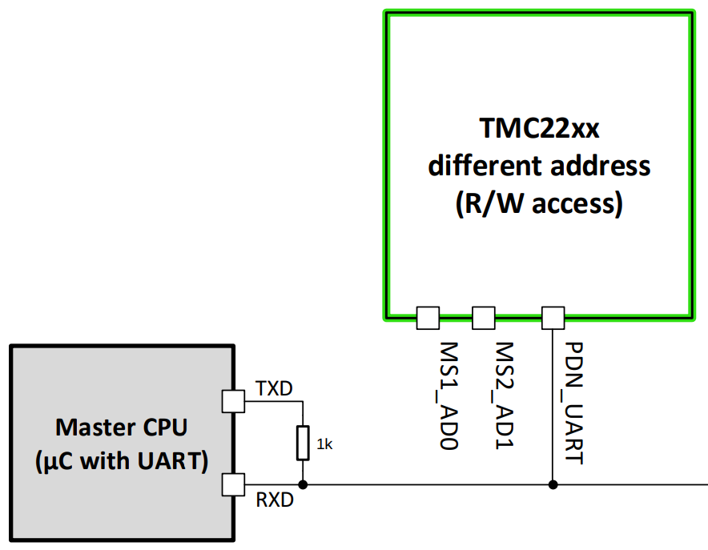

# TMC2209

ESPHome component to control a stepper motor using an ADI (formerly Trinamic) TMC2209 stepper motor driver over UART. Technical information can be found in the [datasheet] section 1.2.1.

This implementation contains two parts: a base component that facilitates serial communication with and feedback from the TMC2209 driver, and a stepper component that allows control of the motor over serial or via step/dir.

> [!IMPORTANT]
*NOTE: Only a single `tmc2209` instance per UART config is currently supported.*

## Wiring

!MORE TO COME!

<!-- Generic UART wiring between host microcontroller from [datasheet] section 4.3.
 -->


## Config

Import the component(s).
```yaml
external_components:
  - source: github://slimcdk/esphome-custom-components
    components: [ tmc2209, stepdir ]
```
---

Configuration of [UART Bus](https://esphome.io/components/uart.html).

> [!IMPORTANT]
**TX and RX must be provided**

> [!CAUTION] A lot is happening over serial and low baud rates might cause warnings about the component taking too long. Use something like 115200 or higher.


```yaml
uart:
  tx_pin: REPLACEME
  rx_pin: REPLACEME
  baud_rate: 115200 # 9600 -> 500k
```
> *TMC2209 will auto-detect baud rates from 9600 to 500k with an internal oscillator. An external oscillator is needed for baud rates higher than 500k.*
---

Base configuration that facilitates fundamental interaction with the driver like serial communication, event handling, and basic configuration for a generic setup with ESPHome.

```yaml
tmc2209:
  id: driver
  address: 0x00
  index_pin: REPLACEME
  diag_pin: REPLACEME # highly recommended to set
  rsense: 110 mOhm    # highly recommended to set
  oscillator_freq: 12MHz
```
* `id` (**Required**, [ID][config-id]): Specify the ID of the component so that you can reference it from elsewhere.

* `index_pin` (*Optional* | **Required**, [Input Pin Schema][config-pin]): Configured for warning alerts or stepping feedback from the internal step pulse generator on the driver when `tmc2209` stepper component is configured. Is required when using `tmc2209` stepper component.

* `diag_pin` (Optional, [Input Pin Schema][config-pin]): StallGuard signaling from the driver. If not defined, the less reliable detection over UART will be used instead. Do not use `diag_pin` to configure the DIAG for anything other than StallGuard output. The component will handle the configuration automatically.

* `address` (Optional, hex): UART address of the IC. Configured by setting MS1_AD0 or MS2_AD1 high or low. Default is `0x00`.

* `rsense` (Optional, resistance): Motor current sense resistors. Varies from ~75 to 1000 mOhm. Consult [datasheet] section 8 for a lookup table.

* `oscillator_freq` (Optional, frequency): Timing reference for all functionalities of the driver. Defaults to 12MHz, which all drivers are factory calibrated to.

> [!WARNING]
**Activation of the driver is delegated to the stepper component to perform. Long wires connected to ENN might pick up interference causing the driver to make a "sizzling" noise if floating.**

---
### The stepper can be controlled in two ways
> [!CAUTION]
**Don't configure multiple stepper components for same physical driver!**

#### Using serial (UART)
Accuracy is slightly reduced in favor of tight timings and high-frequency stepping pulses. Pulse generation is unaffected by ESPHome's handling of other components or main thread execution. This means that the host microcontroller (e.g., ESP32) running ESPHome doesn't provide the step generation, but it is handled internally by the driver. Highly recommended for use with high microstep interpolation or true silent operation.

Relevant info can be found in [datasheet] section 1.3.

```yaml
stepper:
  - platform: tmc2209
    id: motor
    enn_pin: REPLACEME
    max_speed: 500 steps/s
    acceleration: 1000 steps/s^2 # optional
    deceleration: 1000 steps/s^2 # optional
```
* `id` (**Required**, [ID][config-id]): Specify the ID of the stepper so that you can control it.

* `enn_pin` (**Required**, [Output Pin Schema][config-pin]): Enable not input pin for the driver. No need for manual inverted config as inverted logic is handled internally.

* All other from [Base Stepper Component](base-stepper-component)

> [!IMPORTANT]
**In this mode, `index_pin` is will receive stepping feedback from the driver's internal step generator and is required to be set.**
> *Previous index usage is now handled over UART.*


#### Using traditional stepping pulses and direction
Stepping pulses are handled by the main thread but utilize [increased execution frequency functionality](highfrequencylooprequester) to generate pulses as fast as possible. Pulses are therefore limited to whenever the ESP can generate a pulse, and any timing inconsistencies become audible when the motor runs. *NOTE: more components slow the main thread more.*

Example config of [stepdir](../stepdir/) for a TMC2209 driver.
```yaml
stepper:
  - platform: stepdir
    id: motor
    step_pin: REPLACEME
    dir_pin: REPLACEME
    max_speed: 500 steps/s

    # optional
    sleep_pin:
      number: REPLACEME
      inverted: true
    acceleration: 1000 steps/s^2
    deceleration: 1000 steps/s^2
```
*Inverted sleep pin is required for TMC2209*


## Automation

### `on_alert`
An alert event is fired whenever a warning or error is registered. For instance when the motor stalls. This event can be used for sensorless homing. Works both with control over serial (UART) and by stepping and direction pulses.
```yaml
tmc2209:
  id: driver
  ...
  on_alert:
    - if:
        condition:
          lambda: return alert == tmc2209::STALLED;
        then:
          - logger.log: "Motor stalled!"
          - stepper.stop: motor
```

#### Current supported alert events

  * `INDEX_TRIGGERED` When a warning flag is raised. *Not firing when configured for stepping feedback*

#### Diagnostics output
  * `DIAG_TRIGGERED` DIAG output is triggered. Primarily driver errors.
  * `STALLED` Motor crossed Stallguard thresholds and is considered stalled.

##### Temperature events
  * `TEMPERATURE_NORMAL` Driver has recovered to a safe operational temperature.
  * `OVERTEMPERATURE_PREWARNING` Driver is warning about increasing temperature. (happens at 120C)
  * `OVERTEMPERATURE_PREWARNING_GONE` Above warning is dismissed.
  * `OVERTEMPERATURE` Driver is at critial high temperature and is shutting down.
  * `OVERTEMPERATURE_GONE` Above warning is dismissed.
  * `TEMPERATURE_BELOW_120C` Temperature is higher than 120C.
  * `TEMPERATURE_ABOVE_120C` Temperature is lower then 120C.
  * `TEMPERATURE_BELOW_143C` Temperature is higher than 143C.
  * `TEMPERATURE_ABOVE_143C` Temperature is lower then 143C.
  * `TEMPERATURE_BELOW_150C` Temperature is higher than 150C.
  * `TEMPERATURE_ABOVE_150C` Temperature is lower then 150C.
  * `TEMPERATURE_BELOW_157C` Temperature is higher than 157C.
  * `TEMPERATURE_ABOVE_157C` Temperature is lower then 157C.

## Actions

### `tmc2209.configure` Action
Example of configuring the driver on boot.
```yaml
esphome:
  ...
  on_boot:
    - tmc2209.configure:
        id: motor
        inverse_direction: false
        microsteps: 4
        coolstep_tcoolthrs: 400
        stallguard_sgthrs: 75
        interpolation: true
        rms_current: 800mA
        rms_current_hold_scale: 0%
```

* `id` (**Required**, ID): Reference to the stepper tmc2209 (base, not stepper) component.

* `microsteps` (*Optional*, int, [templatable](config-templatable)): Microstepping. Possible values are `1`, `2`, `4`, `8`, `16`, `32`, `64`, `128`, `256`.

* `inverse_direction` (*Optional*, bool, [templatable](config-templatable)): Inverse the rotational direction.

* `coolstep_tcoolthrs` (*Optional*, int, [templatable](config-templatable)): Value for the COOLSTEP TCOOL threshold.

* `stallguard_sgthrs` (*Optional*, int, [templatable](config-templatable)): Value for the StallGuard2 threshold.

* `interpolation` (*Optional*, bool, [templatable](config-templatable)): The actual microstep resolution (MRES) becomes extrapolated to 256 microsteps for the smoothest motor operation.

* `rms_current` (*Optional*, current, [templatable](config-templatable)): TODO

* `rms_current_hold_scale` (*Optional*, percentage, [templatable](config-templatable)): TODO


### Example config for BTT TMC2209 breakout board
```yaml
external_components:
  - source: github://slimcdk/esphome-custom-components@reworked-tmc2209
    components: [tmc2209]

esp32:
  board: ...
  variant: ...

wifi:
  ssid: !secret WIFI_SSID
  password: !secret WIFI_PASSWORD

esphome:
  name: actuator
  on_boot:
    - tmc2209.configure:
        id: driver
        coolstep_tcoolthrs: 400
        stallguard_sgthrs: 50
        microsteps: 2
        interpolation: true
        rms_current: 800mA

uart:
  tx_pin: 14
  rx_pin: 27
  baud_rate: 500000

tmc2209:
  id: driver
  index_pin: 12
  diag_pin: 13
  rsense: 110 mOhm
  on_alert:
    - if:
        condition:
          lambda: return alert == tmc2209::DIAG_TRIGGERED;
        then:
          - logger.log: "DIAG triggered"
          - stepper.stop: motor

stepper:
  - platform: tmc2209
    id: motor
    tmc2209_id: driver
    enn_pin: 4
    max_speed: 500 steps/s
    acceleration: 1000 steps/s^2
    deceleration: 1000 steps/s^2

  # - platform: stepdir
  #   id: motor
  #   step_pin: 15
  #   dir_pin: 2
  #   sleep_pin:
  #     number: 4
  #     inverted: true
  #   max_speed: 500 steps/s
  #   acceleration: 1000 steps/s^2
  #   deceleration: 1000 steps/s^2

button:
  - platform: template
    name: Stop
    on_press:
      - stepper.stop: motor

  - platform: template
    name: 1000 Steps forward
    on_press:
      - stepper.set_target:
          id: motor
          target: !lambda return id(motor).current_position +1000;

  - platform: template
    name: 1000 Steps backward
    on_press:
      - stepper.set_target:
          id: motor
          target: !lambda return id(motor).current_position -1000;

number:
  - platform: template
    name: Target position
    min_value: -100000
    max_value: 100000
    step: 100
    lambda: return id(motor)->current_position;
    update_interval: 1s
    internal: true
    set_action:
      - stepper.set_target:
          id: motor
          target: !lambda "return x;"

sensor:
  - platform: template
    name: Estimated motor load
    lambda: return id(driver)->motor_load();
    update_interval: 100ms
    internal: true

  - platform: template
    name: Stallguard result
    lambda: return id(driver)->stallguard_sgresult();
    update_interval: 100ms
    internal: true
```

Output of the above configuration.
```console
...
[00:00:00][C][uart.idf:159]: UART Bus 1:
[00:00:00][C][uart.idf:160]:   TX Pin: GPIO14
[00:00:00][C][uart.idf:161]:   RX Pin: GPIO27
[00:00:00][C][uart.idf:163]:   RX Buffer Size: 256
[00:00:00][C][uart.idf:165]:   Baud Rate: 500000 baud
[00:00:00][C][uart.idf:166]:   Data Bits: 8
[00:00:00][C][uart.idf:167]:   Parity: NONE
[00:00:00][C][uart.idf:168]:   Stop bits: 1
[00:00:00][C][tmc2209:017]: TMC2209:
[00:00:00][C][tmc2209:019]:   INDEX pin: GPIO12
[00:00:00][C][tmc2209:022]:   DIAG pin: GPIO13
[00:00:00][C][tmc2209:024]:   RSense: 0.11 Ohm (External)
[00:00:00][C][tmc2209:025]:   Address: 0x00
[00:00:00][C][tmc2209:026]:   Detected IC version: 0x21
[00:00:00][C][tmc2209:027]:   Oscillator frequency: 12000000 Hz
[00:00:00][C][tmc2209.stepper:036]: TMC2209 Stepper:
[00:00:00][C][tmc2209.stepper:037]:   ENN pin: GPIO4
[00:00:00][C][tmc2209.stepper:038]:   Acceleration: 1000 steps/s^2
[00:00:00][C][tmc2209.stepper:038]:   Deceleration: 1000 steps/s^2
[00:00:00][C][tmc2209.stepper:038]:   Max Speed: 500 steps/s
...
```


## Resources
* https://esphome.io/components/uart
* https://esphome.io/components/stepper
* https://github.com/slimcdk/esphome-custom-components/tree/master/esphome/components/stepdir

## TODOs
* Example schematics and configs for well-known driver modules.
* Learning resources on how to tune COOLSTEP/StallGuard.
* Driver error detection on the DIAG pin or UART and event broadcasting.


[datasheet]: <./docs/TMC2209_datasheet_rev1.09.pdf> "Datasheet rev 1.09"

[config-id]: <https://esphome.io/guides/configuration-types#config-id> "ESPHome ID Config Schema"
[config-pin]: <https://esphome.io/guides/configuration-types#config-pin-schema> "ESPHome Pin Config Schema"
[config-templatable]: <https://esphome.io/automations/templates#config-templatable> "Templatable configuration"

[base-stepper-component]: <https://esphome.io/components/stepper/#base-stepper-configuration> "Base Stepper Component"

[highfrequencylooprequester]: <https://github.com/esphome/esphome/blob/9713458368dfb9fd9aab8016cfe8c85d77b04887/esphome/core/helpers.h#L609> "HighFrequencyLoopRequester class"
