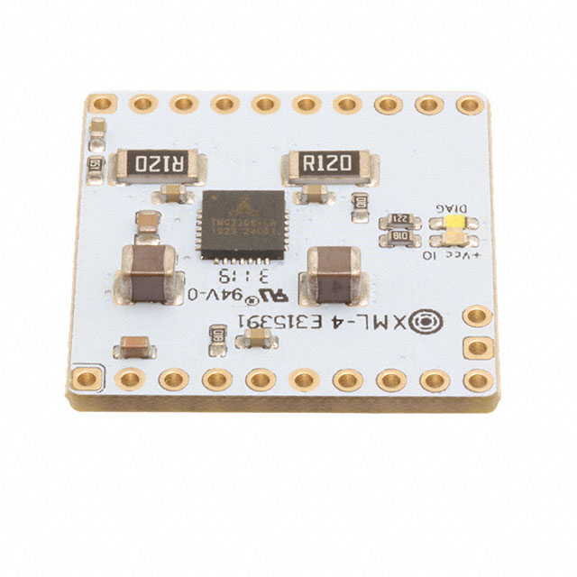
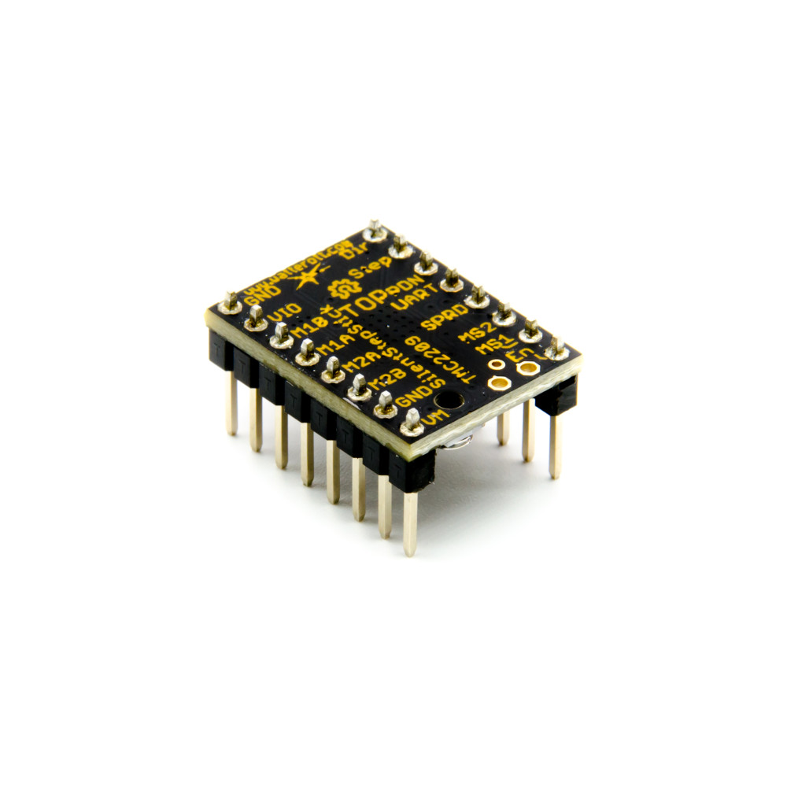
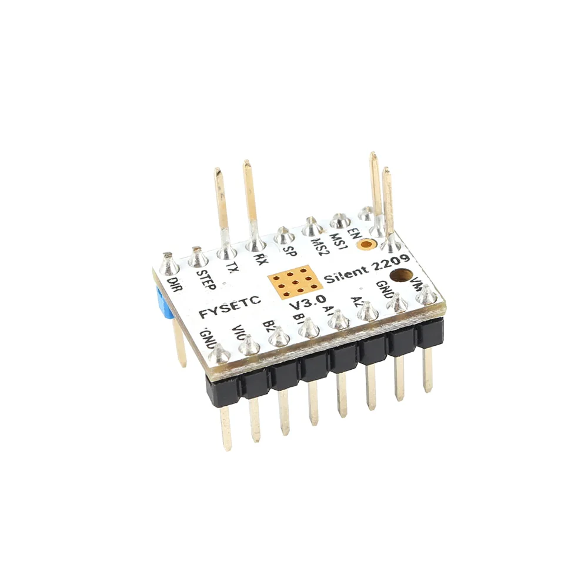
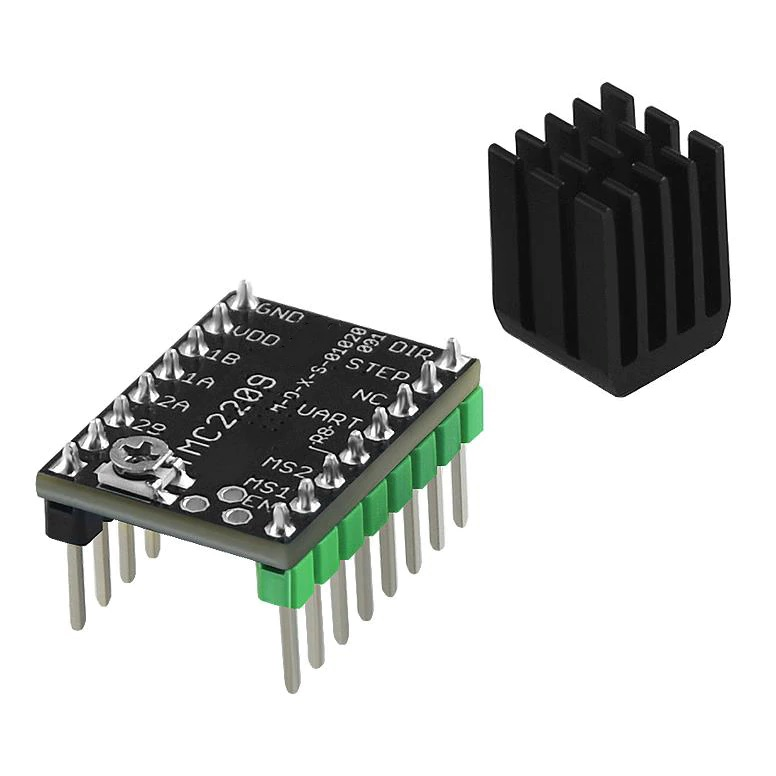

# TMC2209

ESPHome component to control a stepper motor using an ADI (formerly Trinamic) TMC2209 stepper motor driver over UART. Technical information can be found in the [section 1.2.1][datasheet].

This implementation contains multiple parts: a base component that facilitates serial communication with and feedback from the TMC2209 driver, and a stepper component that allows control of the motor over serial or via step/dir.

> [!IMPORTANT]
*Only a single `tmc2209` instance per UART config is currently supported.*


## Config

Import the component(s).
```yaml
external_components:
  - source: github://slimcdk/esphome-custom-components
    components: [ tmc2209, stepper, stepdir ]
```
---

Configuration of [UART Bus][uart-component].

> [!IMPORTANT]
**TX and RX must be provided**

> [!CAUTION]
**A lot is happening over serial and low baud rates might cause warnings about the component taking too long. Use something like 115200 or higher.**

```yaml
uart:
  tx_pin: REPLACEME
  rx_pin: REPLACEME
  baud_rate: 115200 # 9600 -> 500k
```
> *TMC2209 will auto-detect baud rates from 9600 to 500k with an internal oscillator. An external oscillator is needed for baud rates higher than 500k.*
---

Base configuration that facilitates fundamental interaction with the driver like serial communication, event handling and basic configuration, for a generic setup with ESPHome.

```yaml
tmc2209:
  id: driver
  address: 0x00
  index_pin: REPLACEME
  diag_pin: REPLACEME # highly recommended to set
  rsense: 110 mOhm    # highly recommended to set
  oscillator_freq: 12MHz
```
* `id` (**Required**, [ID][config-id]): Specify the ID of the component so that you can reference it from elsewhere.

* `index_pin` (*Optional* | **Required**, [Input Pin Schema][config-pin]): Configured for warning signaling.
  >Is required when using `tmc2209` stepper component as it serves stepping feedback from the internal step pulse generator. Warning signal detection is moved to UART.

* `diag_pin` (Optional, [Input Pin Schema][config-pin]): Driver error signaling from the driver.
  >If not defined, the less reliable detection over UART will be used instead.

* `address` (Optional, hex): UART address of the IC. Configured by setting MS1_AD0 or MS2_AD1 high or low. Default is `0x00`.

* `rsense` (Optional, resistance): Motor current sense resistors. Varies from ~75 to 1000 mOhm. Consult [section 8][datasheet] for a lookup table.

* `oscillator_freq` (Optional, frequency): Timing reference for all functionalities of the driver. Defaults to 12MHz, which all drivers are factory calibrated to.

> [!CAUTION]
**Activation of the driver is delegated to the stepper component to perform. Long wires connected to ENN might pick up interference causing the driver to make a "sizzling" noise if left floating.**

> [!IMPORTANT]
**First generation of TMC2209s have version `0x21`. Monitor the logger output for `[C][tmc2209:031]:   Detected IC version: 0x21` to see if it is correctly detected.  \
You will see version `0x00` and an error message if the version couldn't be read.**

---
### The stepper can be controlled in two ways
> [!CAUTION]
**Don't configure multiple stepper components for same physical driver!**

#### Using serial (UART)
Accuracy is slightly reduced in favor of tight timings and high-frequency stepping pulses. Pulse generation is unaffected by ESPHome's handling of other components or main thread execution. This means that the host microcontroller (e.g., ESP32) running ESPHome doesn't provide the step generation, but it is handled internally by the driver. Highly recommended for use with high microstep interpolation or true silent operation.

Relevant info can be found in [section 1.3][datasheet].

```yaml
stepper:
  - platform: tmc2209
    id: motor
    enn_pin: REPLACEME
    max_speed: 500 steps/s
    acceleration: 1000 steps/s^2 # optional
    deceleration: 1000 steps/s^2 # optional
```
* `id` (**Required**, [ID][config-id]): Specify the ID of the stepper so that you can control it.

* `enn_pin` (**Required**, [Output Pin Schema][config-pin]): Enable not input pin for the driver. No need for manual inverted config as inverted logic is handled internally.

* All other from [Base Stepper Component][base-stepper-component]

> [!IMPORTANT]
**`index_pin` will receive stepping feedback from the driver's internal step generator and is required to be set.**
> *Previous index usage is now handled over UART.*


#### Using traditional stepping pulses and direction
Stepping pulses are handled by the main thread but utilize [increased execution frequency functionality][highfrequencylooprequester] to generate pulses as fast as possible. Pulses are therefore limited to whenever the ESP can generate a pulse, and any timing inconsistencies become audible when the motor runs.
>*More components take up more resources slowing the main thread.*

Example config of [stepdir](../stepdir/) for a TMC2209 driver.
```yaml
stepper:
  - platform: stepdir
    id: motor
    step_pin: REPLACEME
    dir_pin: REPLACEME
    max_speed: 500 steps/s

    # optional
    sleep_pin:
      number: REPLACEME
      inverted: true
    acceleration: 1000 steps/s^2
    deceleration: 1000 steps/s^2
```
> *Inverted sleep pin is required for TMC2209*


## Automation

### `on_alert`
An alert event is fired whenever a driver warning or error is detected. For instance when the motor stalls. This event can be used for sensorless homing. Works both with control over serial (UART) and with stepping and direction pulses.
```yaml
tmc2209:
  id: driver
  ...
  on_alert:
    - if:
        condition:
          lambda: return alert == tmc2209::STALLED;
        then:
          - logger.log: "Motor stalled!"
          - stepper.stop: motor
```

#### Current supported alert events

  * `INDEX_TRIGGERED` When a warning flag is raised. *Not firing when configured for stepping feedback*

#### Diagnostics output
  * `DIAG_TRIGGERED` DIAG output is triggered. Primarily driver errors.
  * `STALLED` Motor crossed Stallguard thresholds and is considered stalled.

##### Temperature events
  * `TEMPERATURE_NORMAL` Driver has recovered to a safe operational temperature.
  * `OVERTEMPERATURE_PREWARNING` Driver is warning about increasing temperature. (happens at 120C)
  * `OVERTEMPERATURE_PREWARNING_GONE` Above warning is dismissed.
  * `OVERTEMPERATURE` Driver is at critial high temperature and is shutting down.
  * `OVERTEMPERATURE_GONE` Above warning is dismissed.
  * `TEMPERATURE_BELOW_120C` Temperature is higher than 120C.
  * `TEMPERATURE_ABOVE_120C` Temperature is lower then 120C.
  * `TEMPERATURE_BELOW_143C` Temperature is higher than 143C.
  * `TEMPERATURE_ABOVE_143C` Temperature is lower then 143C.
  * `TEMPERATURE_BELOW_150C` Temperature is higher than 150C.
  * `TEMPERATURE_ABOVE_150C` Temperature is lower then 150C.
  * `TEMPERATURE_BELOW_157C` Temperature is higher than 157C.
  * `TEMPERATURE_ABOVE_157C` Temperature is lower then 157C.

## Actions

### `tmc2209.configure` Action
Example of configuring the driver. For instance on boot.
```yaml
esphome:
  ...
  on_boot:
    - tmc2209.configure:
        id: driver
        inverse_direction: false
        microsteps: 4
        coolstep_tcoolthrs: 400
        stallguard_sgthrs: 75
        interpolation: true
        rms_current: 800mA
        rms_current_hold_scale: 0%
```

* `id` (**Required**, ID): Reference to the stepper tmc2209 (base, not stepper) component.

* `microsteps` (*Optional*, int, [templatable][config-templatable]): Microstepping. Possible values are `1`, `2`, `4`, `8`, `16`, `32`, `64`, `128`, `256`.

* `inverse_direction` (*Optional*, bool, [templatable][config-templatable]): Inverse the rotational direction.

* `coolstep_tcoolthrs` (*Optional*, int, [templatable][config-templatable]): Value for the COOLSTEP TCOOL threshold.

* `stallguard_sgthrs` (*Optional*, int, [templatable][config-templatable]): Value for the StallGuard2 threshold.

* `interpolation` (*Optional*, bool, [templatable][config-templatable]): The actual microstep resolution (MRES) becomes extrapolated to 256 microsteps for the smoothest motor operation.

* `rms_current` (*Optional*, current, [templatable][config-templatable]): RMS current setting according to [section 9][datasheet].

* `rms_current_hold_scale` (*Optional*, percentage, [templatable][config-templatable]): TODO


### Sensors

Two metrics from the driver is exposed as a ready-to-use sensor component.


```yaml
sensor:
  - platform: tmc2209
    type: stallguard_result
    name: Driver stallguard
    update_interval: 1s

  - platform: tmc2209
    type: motor_load
    name: Motor load
    update_interval: 100ms
```

* `type` (**Required**):
  * `stallguard_result` Stator angle shift detected by the driver.
  * `motor_load` Percentage off stall calculated from StallGuard result and set StallGuard threshold. 100% = stalled
* `tmc2209_id` (*Optional*, [ID][config-id]): Manually specify the ID of the `tmc2209` you want to use this sensor.

* All other from [Sensor][base-sensor-component]


## Example config
```yaml
external_components:
  - source: github://slimcdk/esphome-custom-components
    components: [tmc2209, stepper]

# esp32 or esp8266 config..

wifi:
  ssid: !secret WIFI_SSID
  password: !secret WIFI_PASSWORD

esphome:
  name: actuator
  on_boot:
    - tmc2209.configure:
        id: driver
        coolstep_tcoolthrs: 400
        stallguard_sgthrs: 50
        microsteps: 2
        interpolation: true
        rms_current: 800mA

uart:
  tx_pin: 14
  rx_pin: 27
  baud_rate: 500000

tmc2209:
  id: driver
  index_pin: 12
  diag_pin: 13
  rsense: 110 mOhm
  on_alert:
    - if:
        condition:
          lambda: return alert == tmc2209::STALLED;
        then:
          - logger.log: "DIAG triggered"
          - stepper.stop: motor

stepper:
  - platform: tmc2209
    id: motor
    tmc2209_id: driver
    enn_pin: 4
    max_speed: 500 steps/s
    acceleration: 1000 steps/s^2
    deceleration: 1000 steps/s^2

button:
  - platform: template
    name: Stop
    on_press:
      - stepper.stop: motor

  - platform: template
    name: 1000 Steps forward
    on_press:
      - stepper.set_target:
          id: motor
          target: !lambda return id(motor).current_position +1000;

  - platform: template
    name: 1000 Steps backward
    on_press:
      - stepper.set_target:
          id: motor
          target: !lambda return id(motor).current_position -1000;

number:
  - platform: template
    name: Target position
    min_value: -100000
    max_value: 100000
    step: 100
    lambda: return id(motor)->current_position;
    update_interval: 1s
    set_action:
      - stepper.set_target:
          id: motor
          target: !lambda "return x;"

sensor:
  - platform: tmc2209
    type: motor_load
    name: Motor load
    update_interval: 100ms
```

Output of the above configuration.
```console
...
[08:51:47][C][uart.idf:159]: UART Bus 1:
[08:51:47][C][uart.idf:160]:   TX Pin: GPIO27
[08:51:47][C][uart.idf:161]:   RX Pin: GPIO26
[08:51:47][C][uart.idf:163]:   RX Buffer Size: 256
[08:51:47][C][uart.idf:165]:   Baud Rate: 500000 baud
[08:51:47][C][uart.idf:166]:   Data Bits: 8
[08:51:47][C][uart.idf:167]:   Parity: NONE
[08:51:47][C][uart.idf:168]:   Stop bits: 1
[08:51:47][C][tmc2209:017]: TMC2209:
[08:51:47][C][tmc2209:020]:   INDEX Pin: GPIO12
[08:51:47][C][tmc2209:024]:   DIAG Pin: GPIO13
[08:51:47][C][tmc2209:027]:   RSense: 0.11 Ohm (External)
[08:51:47][C][tmc2209:028]:   Address: 0x00
[08:51:47][C][tmc2209:031]:   Detected IC version: 0x21
[08:51:47][C][tmc2209:036]:   Oscillator frequency: 12000000 Hz
[08:51:47][C][tmc2209.stepper:036]: TMC2209 Stepper:
[08:51:47][C][tmc2209.stepper:037]:   ENN Pin: GPIO14
[08:51:47][C][tmc2209.stepper:038]:   Acceleration: 1000 steps/s^2
[08:51:47][C][tmc2209.stepper:038]:   Deceleration: 1000 steps/s^2
[08:51:47][C][tmc2209.stepper:038]:   Max Speed: 500 steps/s
...
```


### Advanced

Writing to and reading from registers and register fields from the driver can easily be done with the help of preexisting [helper definitions][tmcapi-tmc2209-hwa] from the underlying TMC-API. A description of the register map can be found under [section 5][datasheet].
> [!IMPORTANT]
**The `tmc2209` base component holds a mirror in memory of the values written to the driver. This means write-only registers can still be read with below methods provided they have been written already.**
>
>*Definitions ending in `_MASK` or `_SHIFT` should not be used.*

The `tmc2209` base component exposes four methods:
* `void write_register(uint8_t address, int32_t value)` write/overwrite an entire register.
* `int32_t read_register(uint8_t address)` read an entire registers.
* `void write_field(RegisterField field, uint32_t value)` write/overwrite a register field.
* `uint32_t read_field(RegisterField field)` read a register field.

> [!CAUTION]
> Overwriting some registers may cause instability in the ESPHome component.


Example usage in lambdas
```yaml
sensor:

    // Read stallguard result (register) into a sensor
  - platform: template
    name: Stallguard result
    lambda: return id(driver)->read_register(TMC2209_SG_RESULT);

    // Read microstep selection index into a sensor. This is a binary exponent like 0,1,2,3,... and microsteps can be calculated like 2**<exponent>
  - platform: template
    name: Microstep selection index
    lambda: return id(driver)->read_field(TMC2209_MRES_FIELD);


number:

    // Write value to stallguard threshold register
  - platform: template
    name: Stallguard threshold
    update_interval: 1s
    min_value: 0
    max_value: 255
    step: 5
    lambda: return id(driver)->read_register(TMC2209_SGTHRS);
    set_action:
      - lambda: id(driver)->write_register(TMC2209_SGTHRS, x);


button:

    // Write value 3 to MRES register field. 2**3 = 8
  - platform: template
    name: Set microstepping to 8
    on_press:
      - lambda: id(driver)->write_field(TMC2209_MRES_FIELD, 3);

```


## Wiring
Guides to wire ESPHome supported MCU to a TMC2209 driver for either only UART control or pulse train control.

### UART Control

Wiring for [UART control](#using-serial-uart). `DIAG` is optional but recommended for reliability.


### Pulse train control
Wiring for [Pulse Train control](#using-traditional-stepping-pulses-and-direction).


> [!IMPORTANT]
> Most drivers come as breakout modules and connections can often be labeled slightly differently. `PDN_UART` was often not labeled, as serial communication was rarly used in the early days, but is apparent on nearly all new modules.


#### Examples of modules
<p align="center">
  
  
  
  
  
</p>


## Resources
* https://esphome.io/components/uart
* https://esphome.io/components/stepper
* https://github.com/slimcdk/esphome-custom-components/tree/master/esphome/components/stepdir


## TODOs
* Learning resources on how to tune StallGuard etc.
* Driver error detection on the DIAG pin or UART and event broadcasting.
* Write default register to driver.
* Reconfigure driver if driver was power cycled.
* Driver warning and error trigger events.
* Handle changes written directly to the driver.
* Write default register on start?

[datasheet]: <./docs/TMC2209_datasheet_rev1.09.pdf> "Datasheet rev 1.09"

[config-id]: <https://esphome.io/guides/configuration-types#config-id> "ESPHome ID Config Schema"
[config-pin]: <https://esphome.io/guides/configuration-types#config-pin-schema> "ESPHome Pin Config Schema"
[config-templatable]: <https://esphome.io/automations/templates#config-templatable> "Templatable configuration"
[uart-component]: <https://esphome.io/components/uart.html> "ESPHome UART Config"
[base-stepper-component]: <https://esphome.io/components/stepper/#base-stepper-configuration> "ESPHome Base Stepper Component"
[base-sensor-component]: <https://esphome.io/components/sensor/#config-sensor> "ESPHome Base Sensor Component"

[highfrequencylooprequester]: <https://github.com/esphome/esphome/blob/9713458368dfb9fd9aab8016cfe8c85d77b04887/esphome/core/helpers.h#L609> "HighFrequencyLoopRequester class"

[tmcapi-tmc2209-hwa]: <https://github.com/slimcdk/TMC-API/blob/master/tmc/ic/TMC2209/TMC2209_HW_Abstraction.h> "TMC-API TMC2209 Hardware Abstractions"

